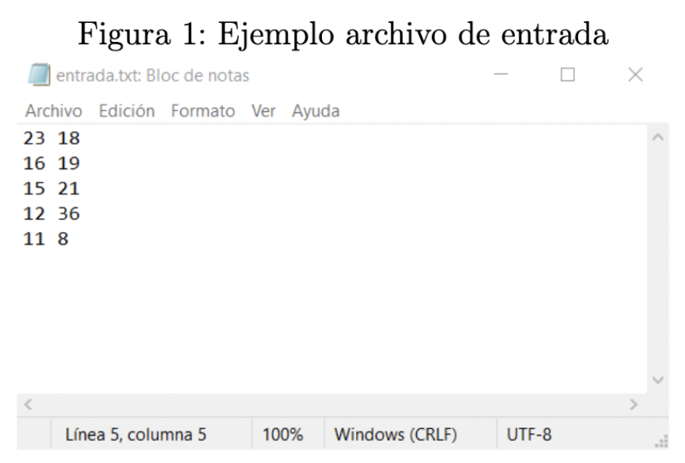
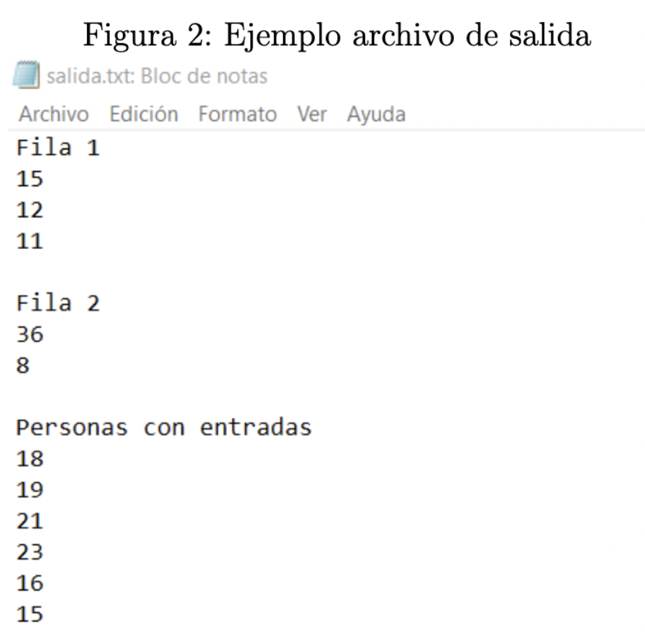

# Algoritmos y Estructuras de Datos: Linked List 📚

## Enunciado

Un cine ha decidido regalar entradas gratis para unade sus funciones, pero bajo ciertas condiciones. El cine ha formado a las diversas personasque han llegado para las entradas en dos filas del mismo tamaño **n**. La condición para obtener una entrada son las siguientes:

- Entre las dos personas que estén al frente de la fila,la persona que tenga lamenor edad se gana una entrada y entra a la función.

- Si dos personas tienen la misma edad, ambas personasganan entrada y entran ala función.

- Si sólo queda una fila con personas, estas irán ganandoentradas en el orden quese encuentran hasta que se acaben las entradas.

- Puede darse el caso en que sobren entradas.

El cine cuenta con una cantidad limitada de entradas para la función, y precisa saber el orden en el que quedan las personas en las filas al momento en que se agotan las entradas. También precisa saber el orden en el quehan ingresado las personas a la función.

Para lo anterior, se pide utilizar el lenguaje de programación **C**, y utilizando listas enlazadas, indicar el orden en el que han ingresadolas personas a la función, e indicare l estado de las dos filas al momento en que se han acabado las entradas.

Como entrada para su programa, se ingresará un archivo de texto el cual contendrá las dos filas de persona, en donde cada persona será identificada con su edad. A su vez, por línea de comandos se pedirá ingresar la cantidad deentradas disponibles para dar.

Se pide que como salida se genere un archivo de textoen donde se generan trescolumnas, en donde cada columna será:

- La **primera fila** con las personas que no consiguieron entrar a la función.

- La **segunda fila** con las personas que no consiguieron entrar a la función.

- Las personas que lograron entrar a la función en el orden correspondiente.

Para el caso de la representación de las filas, se considera que el primer elemento de la lista es la primera persona en la fila, y para el caso de las personas que han entrado, el primer elemento de la lista corresponde a la primera persona en haber ingresado a la función.

## Ejemplo

En la _figura 1_ se puede ver un ejemplo de archivo de entrada, donde la primera columna orresponde a cada persona de la fila 1 con su respectiva edad, y en la columna dos a cada persona de la fila 2 con su respectiva edad.

_Figura 1. Ejemplo archivo de entrada._

En la _figura 2_ se puede observar un ejemplo de archivo de salida dada la entrada presentada en la figura 1.

_Figura 2. Ejemplo archivo de salida._
